<a href="https://github.com/Saddouri20">github.com/Saddouri20</a>

> Building practical tools across Python and TypeScript.
I enjoy turning small ideas into usable interfaces, experiments, and automation. Recent work includes an AI day planner, a supportive daily check-in app, and a few playful web projects.

<samp>python &nbsp; typescript &nbsp; javascript &nbsp; react &nbsp; tailwind css &nbsp; openai &nbsp; html &nbsp; css &nbsp; git</samp>

**[v0-smart-day-planner-ai](https://github.com/Saddouri20/v0-smart-day-planner-ai)** &nbsp;·&nbsp; <samp>typescript, react, openai</samp> 
AI-assisted day planning that turns tasks, priorities, and available time into a structured schedule.

**[Daily-Mental-Health-Check-in](https://github.com/Saddouri20/Daily-Mental-Health-Check-in)** &nbsp;·&nbsp; <samp>typescript, react</samp> 
A calm, non-clinical space for mood reflection, supportive messages, guided wellness techniques, and personal history.

**[BeMyValentine](https://github.com/Saddouri20/BeMyValentine)** &nbsp;·&nbsp; <samp>css</samp> 
A small interactive web experiment built around a playful visual experience.

**[WannaGoOutOnADateWithMe](https://github.com/Saddouri20/WannaGoOutOnADateWithMe)** &nbsp;·&nbsp; <samp>html</samp> 
A lightweight personal web experiment with a direct, memorable presentation.

Every graphic here is generated inside this repository rather than loaded from a third-party card service. Before each scheduled refresh, [`scripts/sync_avatar.py`](scripts/sync_avatar.py) downloads the current GitHub avatar into `assets/avatar.png`, and [`scripts/make_avatar_ascii.py`](scripts/make_avatar_ascii.py) turns it into the self-typing `ascii.svg`. The contribution graphics and section headings are generated by [`scripts/generate_stats.py`](scripts/generate_stats.py) from GitHub’s GraphQL API, then refreshed by [a scheduled GitHub Action](.github/workflows/stats.yml).

The action uses the repository’s built-in `GITHUB_TOKEN`, commits only when the generated files change, and deliberately has no `push` trigger so its own commits do not create a loop. The SVGs use SMIL animation because GitHub strips scripts from README content, and the included JetBrains Mono subsets keep the portrait and data graphics aligned across viewers.
